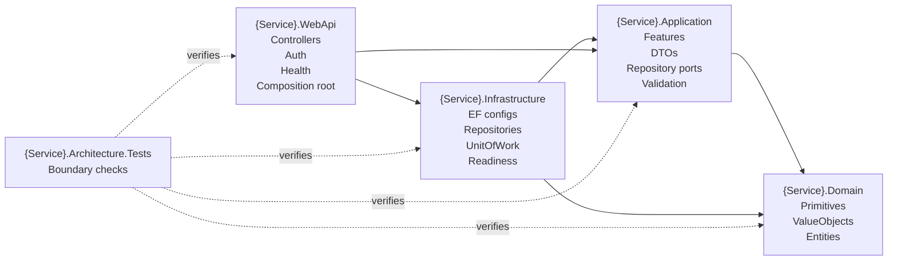

# microgen

`microgen` generates deterministic .NET CRUD microservice scaffolds from a strict JSON config. It is CLI-first, includes a simple terminal UI for guided edits, and writes Clean Architecture-style C# projects with ASP.NET Core, EF Core SQL Server, JWT Bearer auth, health checks, and test projects.

## Quick Start

Prerequisites: Go 1.22+ and a .NET SDK supported by your config (`net8.0`, `net9.0`, or `net10.0`).

```bash
git clone <repo-url>
cd generator-microservices-go
go test ./...
go run ./cmd/microgen generate --config examples/product-service.json --output ./out
dotnet build ./out/CommercePlatform.sln -warnaserror
```

Run a generated WebApi by supplying normal .NET configuration values:

```bash
ConnectionStrings__DefaultConnection='Server=localhost;Database=Products;TrustServerCertificate=True' \
Authentication__Authority='https://issuer.example.com' \
Authentication__Audience='ProductService' \
  dotnet run --project ./out/src/ProductService/ProductService.WebApi/ProductService.WebApi.csproj
```

Use trusted certificates outside local development.

## Commands

```bash
microgen version
microgen generate --config <path> --output <dir> [--force]
microgen tui --config <path> --output <dir> [--force]
microgen tui --new --config <path> --output <dir> [--force]
```

| Command | Use |
| --- | --- |
| `version` | Print release version, source commit, and build date. |
| `generate` | Generate from an existing JSON config. |
| `tui` | Open the terminal UI over the same generation core. |
| `tui --new` | Create a starter config, then open the terminal UI. |

Useful flags:

- `--config`: strict JSON config path.
- `--output`: directory to create or replace with generated files.
- `--force`: replace only verified, unchanged output previously generated by `microgen`.
- `--new`: create a starter config; refuses to overwrite an existing file.

## Terminal UI

The TUI is a guided editor for the same config and generation engine used by the CLI. Use it to create or adjust solution metadata, target framework, services, value objects, entities, fields, preview output, and generate. Basic navigation uses arrows or `j`/`k`, Enter to select or save, Esc to go back, and `q` or Ctrl+C to quit.

## Generated Architecture

For each service, `microgen` emits Domain, Application, Infrastructure, WebApi, and architecture-test projects.



CRUD operations are generated as Application feature slices. Infrastructure owns EF Core SQL Server details, including rowversion concurrency mapping. WebApi is the executable composition root and wires controllers, auth, health checks, ProblemDetails, OpenTelemetry, Infrastructure, and startup guards.

## Minimal Config

```json
{
  "schemaVersion": 1,
  "generation": {
    "targetFramework": "net8.0",
    "enableValueObjectPreflight": false
  },
  "solution": {
    "name": "CommercePlatform"
  },
  "services": [
    {
      "name": "ProductService",
      "valueObjects": [
        {
          "name": "ProductName",
          "type": "string",
          "validations": {
            "required": true,
            "minLength": 3,
            "maxLength": 100,
            "validExample": "Product Prime",
            "invalidExample": "***"
          }
        }
      ],
      "entities": [
        {
          "name": "Product",
          "fields": [
            { "name": "Id", "type": "Guid" },
            { "name": "Name", "type": "ProductName" },
            { "name": "Price", "type": "decimal" }
          ]
        }
      ]
    }
  ]
}
```

Each entity needs exactly one `Id` field of type `Guid`. Supported scalar field types are `bool`, `DateTime`, `decimal`, `double`, `Guid`, `int`, `long`, and `string`. Value Objects can wrap supported scalar types and provide basic validation rules.

## Safety Guarantees

- Generation does not run `dotnet`, NuGet, shell commands, migrations, package installation, or database commands.
- Config validation rejects unknown fields, duplicate names, invalid identifiers, invalid paths, unsupported target frameworks, and invalid entity identity fields before output is created.
- Output is published through a private staging directory with deterministic ordering and formatting.
- `--force` replaces only generated directories with a valid manifest, expected file hashes, and no unknown files or symlinks.
- Generated CRUD routes require JWT Bearer authorization; no production signing secret is generated.
- Generated dependency versions are centralized in `Directory.Packages.props` and controlled by `internal/generator/policy/dependency-policy.json`.

`microgen` protects normal local generation from accidental overwrites and misleading symlink paths. It is not a security sandbox against a malicious same-user process mutating the filesystem concurrently; generate into a trusted parent directory.

## Generated Output Notes

- Auth: WebApi reads `Authentication:Authority` and `Authentication:Audience`, including environment variables such as `Authentication__Authority` and `Authentication__Audience`.
- Health: `/health/live` stays lightweight. `/health/ready` checks SQL connectivity and generated EF model smoke queries; external failure responses stay generic.
- EF and SQL: Infrastructure uses EF Core SQL Server, bounded retries/timeouts, repositories, UnitOfWork, and shadow rowversion concurrency.
- Migrations: generated Infrastructure includes EF design-time support. For local development, run:

  ```bash
  dotnet ef migrations add InitialCreate --project ./out/src/ProductService/ProductService.Infrastructure --startup-project ./out/src/ProductService/ProductService.Infrastructure
  dotnet ef database update --project ./out/src/ProductService/ProductService.Infrastructure --startup-project ./out/src/ProductService/ProductService.Infrastructure
  ```

  Production or shared deployments should use your team's reviewed migration process.
- OpenTelemetry: generated WebApi emits vendor-neutral traces and metrics. Configure an OTLP collector with `OTEL_EXPORTER_OTLP_ENDPOINT` or explicitly disable the SDK when telemetry is not used.

## Releases

Release builds publish platform archives, checksums, SPDX SBOMs, and GitHub artifact attestations from version tags. See [`RELEASE.md`](RELEASE.md) for release validation, artifact names, package metadata handoff, and repository requirements.

### v0.4.1 hardening scope

v0.4.1 is a defensive hardening release. It refreshes release guidance, adds compile validation for the existing relationship fixture, and clarifies TUI generation status without expanding generated-project semantics.

- It does not add one-to-one relationship support.
- It does not add many-to-many relationship support.
- It does not add cross-service relationship support.

## Current Limitations

- JSON is the only input format.
- Relationships remain scoped to existing single-service one-to-many/many-to-one navigation support.
- Nested or composed Value Objects are not supported yet.
- Docker files and vendor-specific telemetry exporters are not generated.
- Request idempotency keys or operation IDs are not generated; add them at the API/application edge when mutation retries must be unambiguous.
- Production database migration rollout, backup, review, and rollback/fix-forward policy remains a team process, not generated code.
