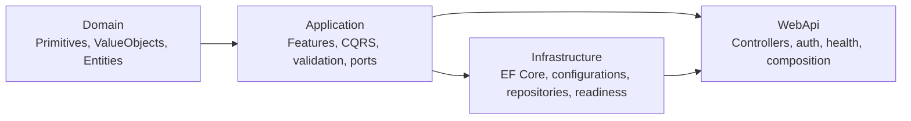

# ShopPlatform

Minimal generated .NET 8 microservice workspace for product management.

Generated services use Clean Architecture, CQRS slices, EF Core SQL Server persistence, JWT authentication, health checks, and manual database-change steps.

## Quick start

1. Configure the values in the table below.
2. Restore, build, and test each service solution.
3. Run the WebApi project for the service you want to start. Start the gateway after service WebApi projects are listening on their configured local ports.

| Setting | Purpose |
|---|---|
| `ConnectionStrings__DefaultConnection` | SQL Server connection string. Use trusted certificates in production; `TrustServerCertificate=True` is for local development only. |
| `Authentication__Authority` | JWT issuer/authority. |
| `Authentication__Audience` | JWT audience expected by the API. |
| `OTEL_EXPORTER_OTLP_ENDPOINT` | Optional OpenTelemetry OTLP endpoint. Set `OTEL_SDK_DISABLED=true` to opt out. |

## Project map



| Project | What lives here |
|---|---|
| `{Service}.Domain` | `Primitives`, `ValueObjects`, and `Entities`. No EF, WebApi, rowversion, or framework dependency. |
| `{Service}.Application` | `Features/{Entity}` vertical slices, commands, queries, validators, DTOs, repository ports, pagination, and unit-of-work port. |
| `{Service}.Infrastructure` | EF Core SQL Server adapter, `Persistence/Configurations`, repositories, UnitOfWork, DbContext factory, and readiness probe. |
| `{Service}.WebApi` | Controllers, JWT auth, HTTPS/HSTS, request timeout, OpenTelemetry, ProblemDetails, health endpoints, and startup wiring. |
| `ShopPlatform.Gateway` | YARP reverse proxy composition for generated WebApi services. |

Architecture tests verify the generated project boundaries.

## Common commands

```bash
dotnet restore ./ProductService/ProductService.sln
dotnet build ./ProductService/ProductService.sln --nologo -warnaserror
MICROGEN_TEST_SQLSERVER='Server=localhost,1433;User Id=sa;Password=<password>;Encrypt=True;TrustServerCertificate=True' \
  dotnet test ./ProductService/ProductService.sln --nologo -warnaserror --blame-hang --blame-hang-timeout 90s --logger "trx;LogFileName=ProductService-tests.trx"
```

| Task | Command |
|---|---|
| Run `ProductService` | `dotnet run --project ./ProductService/src/ProductService.WebApi` |
| Build `ProductService` | `dotnet build ./ProductService/ProductService.sln --nologo -warnaserror` |
| Test `ProductService` | `dotnet test ./ProductService/ProductService.sln --nologo -warnaserror` |
| Run gateway | `dotnet run --project ./src/ShopPlatform.Gateway` |

### Gateway routing

Run each generated WebApi on the deterministic local port shown below, then start `ShopPlatform.Gateway`.

```bash
ASPNETCORE_URLS=http://localhost:5100 dotnet run --project ./ProductService/src/ProductService.WebApi
dotnet run --project ./src/ShopPlatform.Gateway
```


Generated workspaces enable nullable reference types, implicit usings, recommended analyzers, code-style checks during build, and warnings as errors.

## Database changes

The generator prepares EF Core migration tooling, but it does not create migration files, run migrations, or open database connections.

### ProductService

```bash
dotnet ef migrations add InitialCreate --project ./ProductService/src/ProductService.Infrastructure --startup-project ./ProductService/src/ProductService.Infrastructure --output-dir Persistence/Migrations
dotnet ef database update --project ./ProductService/src/ProductService.Infrastructure --startup-project ./ProductService/src/ProductService.Infrastructure
```

For shared, staging, or production environments, use your team's deployment process.

## Health and readiness

| Endpoint | Access | Meaning |
|---|---|---|
| `/health/live` | Anonymous | Process is running. |
| `/health/ready` | Anonymous | SQL connection and generated EF mappings are ready. Failure responses stay generic; logs keep details. |

## Generated services and files

| Service | Generated areas |
|---|---|
| `ProductService` | Domain, Application, Infrastructure, WebApi, Domain.Tests, Application.Tests, Infrastructure.Tests, WebApi.Tests, Architecture.Tests |
| `ShopPlatform.Gateway` | Gateway project, YARP route configuration, and reverse-proxy startup. |

The scaffold command plan and package list are represented in the generated project files. Package versions are centralized in `Directory.Packages.props`.

## Troubleshooting

| Symptom | Check |
|---|---|
| Build fails on warnings | Generated projects treat warnings as errors; fix the first compiler/analyzer message. |
| API returns `401` | Confirm `Authentication__Authority`, `Authentication__Audience`, and the bearer token. |
| `/health/ready` is unavailable | Check SQL connectivity, migrations, mapped columns, and application logs. |
| Value Object migration is risky | Enable `generation.enableValueObjectPreflight`, regenerate, run `ValueObjectPreflight.sql`, and repair invalid rows with business-approved values before creating the migration. |
| Retry outcome is unclear | A connection loss after the database commits but before the acknowledgement leaves the outcome ambiguous; add an operation-identity/idempotency boundary before relying on mutation retries. |
